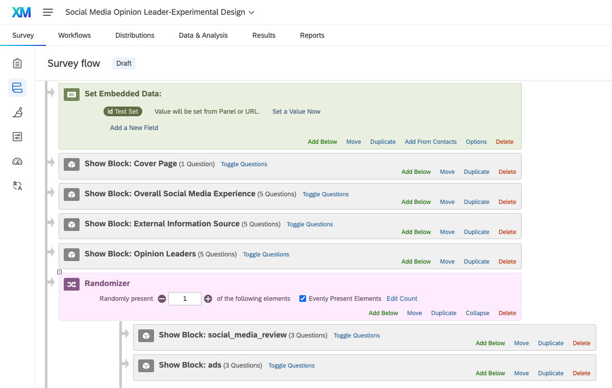
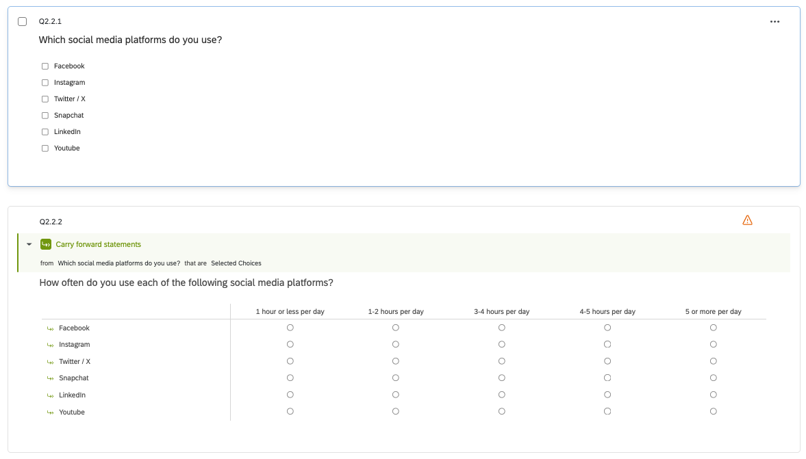
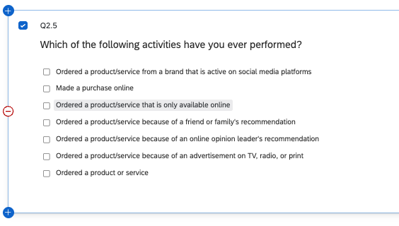
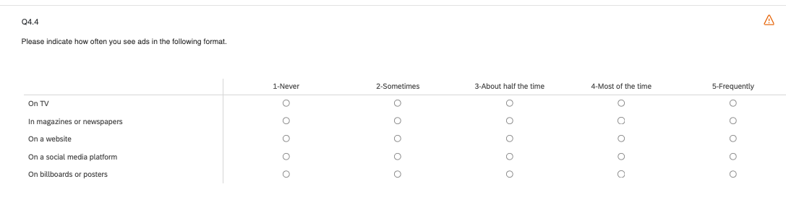
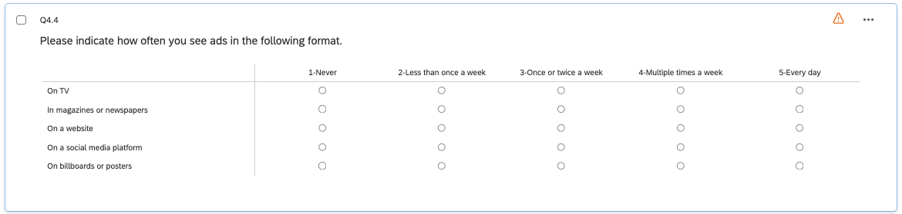
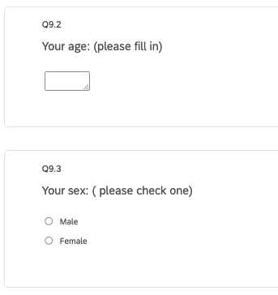
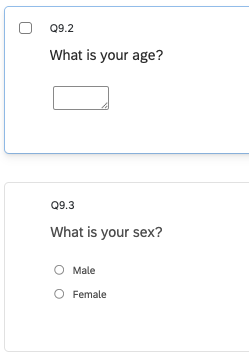

# Random Assignment and Survey Flow

I used the Randomizer differently than how the Word document recommended, and instead directly randomized the display logic of the two blocks. I did not use the embedded variables, and I think this way is a bit cleaner.

# Q2.2 Social Media Usage Improvement

The original problem was that it couldn't collect data for each individual social media, so I used carry forward logic and a big matrix table to allow respondents to answer the question for each of the social medias they selected in the question before.

# Three Additional Survey Improvements

## Improvement 1

Q2.5 was originally a matrix table with yes/no responses and the question "Have you ever performed these activities?". I think this is a bit inaccessible, so I changed it to a multiple choice question asking "Which of the following activities have you ever performed?". This way people can select the ones they have done before and we still get a binary yes or no result.

## Improvement 2

Many questions like 4.4 had weird text formatting, so I went through and corrected all of these. This makes the survey feel more cohesive and professional instead of cobbled together. I also fixed the scale on Q4.4 because I feel like "half the time" and "most of the time" are not very helpful for data collection.

## Improvement 3

In the demographics section, I changed questions 9.2 and 9.3 to be more in-line with the rest of the questions in this section nd the survey as a whole. This also helps with cohesiveness and professionalism.

# Appendix

[GitHub Repo](https://github.com/itsnik1/m02_qualtrics)

[Published GitHub Pages Report](PASTE-LINK-HERE)